# Kalshi Daily Research Dataset

Design document for the new Kalshi daily-resolution research pipeline.

This project is intentionally separate from the legacy Kalshi export, which produces 1-minute candles and a resampled 5-minute probability panel.

Operational command history and dataset decisions are recorded in [`COMMANDS.md`](COMMANDS.md).

## Purpose

Build a reproducible daily dataset that can support the following research question:

> How informative and well-calibrated are prediction-market probabilities across different topics and levels of market activity?

The first platform is Kalshi. The initial resolution is one day. The initial universe includes all technically valid binary markets with significant volume, across all available topics.

The first research outputs are:

- Brier Score;
- Log Loss;
- reliability and calibration tables;
- Brier decomposition where sample size permits;
- results by topic, volume, liquidity, and time to resolution;
- confidence intervals and complete sample/coverage diagnostics.

## Design principles

1. Preserve source provenance and reproducibility.
2. Use the platform's native daily candles instead of downloading all trades.
3. Keep the raw market universe broader than the final analysis sample.
4. Separate market eligibility from research cohorts and reporting filters.
5. Never hide missing observations with untracked forward-filling.
6. Keep the legacy 5-minute dataset unchanged.
7. Keep the raw layer free of research-derived features.
8. Make every release reconstructible from a source database, configuration, and run manifest.

## Target architecture

```mermaid
flowchart LR
    A[Kalshi API] --> B[Raw series, events, and markets]
    B --> C[Market universe]
    C --> D[Topic taxonomy and eligibility]
    D --> E[Selected markets]
    E --> F[Daily history planner]
    F --> G[Live daily candles]
    F --> H[Historical daily candles]
    G --> I[Normalized daily candles]
    H --> I
    I --> J[Quality and coverage checks]
    J --> K[(Daily SQLite dataset)]
    K --> L[Canonical Parquet snapshot]
    L --> M[As-of forecast snapshots]
    M --> N[Evidence report]
    N --> O[Brier, Log Loss, calibration, and topic analysis]
```



## Scope of the first version

### Included

- Kalshi series, event, and market metadata;
- all available categories unless a market fails a technical validity check;
- binary markets;
- significant-volume markets, initially using a configurable volume floor;
- live and historical daily candles;
- resolved outcomes and settlement metadata;
- daily close probability as the primary forecast;
- volume, open interest, spread-related fields, and candle quality flags;
- reproducible canonical releases and research reports.

### Excluded from the first version

- raw trades as the primary history source;
- 1-minute and 5-minute history;
- complex repricing and decisiveness benchmarks;
- aggressive title-based topic exclusion;
- Polymarket integration;
- external covariates and survey data integration.

These may be added later without changing the daily source contract.

## Separation from the legacy pipeline

The current legacy database remains the source for existing 5-minute artifacts:

```text
db/kalshi_probability_dataset.sqlite
```

The new pipeline should use a separate database and output namespace:

```text
db/kalshi_daily_probability_dataset.sqlite
frozen_notebooks/running_artefacts/kalshi_daily/
benchmark_releases/kalshi_daily/
```

Daily and 5-minute rows must not share a table whose key is only `(market_id, timestamp_utc)`. If the datasets are unified in the future, the key must include an explicit frequency or resolution field.

## Data layers

### 1. Raw metadata

Retain the existing series-first structure:

```text
raw_series
raw_markets
raw_events
market_universe
```

The new raw metadata database also contains:

```text
metadata_runs
raw_payloads
```

Stable identifiers:

```text
market_id = kalshi:{ticker}
event_id  = kalshi:event:{event_ticker}
```

`market_universe` should retain markets that do not enter the research sample. This is needed to measure selection bias and topic coverage.

### 2. Selection and taxonomy

Selection should be split into separate concepts:

```text
technical_validity
market_eligibility
analysis_cohort
reporting_slice
```

The initial eligibility rule should be close to:

```text
market_type == binary
AND ticker is present
AND outcome is interpretable
AND timing fields are valid
AND volume_num >= configured_volume_floor
```

The category should not be an allowlist. All categories should pass into the universe, with the platform category and a research taxonomy stored explicitly.

The volume floor is an operational starting point, not the only scientific sample definition. Every release should also retain volume and liquidity tiers for robustness analysis.

### 3. Raw daily candles

The authoritative history table should be a thin, source-preserving table named `raw_daily_candles`. Its fields should be direct values from the Kalshi candle response, with only one-to-one naming and type normalization.

The minimal parsed schema should contain:

```text
market_id
market_ticker
timestamp_utc
end_period_ts
period_interval
source_mode
price_open
price_low
price_high
price_close
price_mean
price_previous
price_min
price_max
yes_bid_open
yes_bid_low
yes_bid_high
yes_bid_close
yes_ask_open
yes_ask_low
yes_ask_high
yes_ask_close
volume
open_interest
request_start_ts
request_end_ts
retrieved_at_utc
run_id
raw_payload_json
```

`timestamp_utc` and the normalized column names are convenience mappings. They must not change the meaning of the source fields.

`raw_payload_json` is retained so that fields added by Kalshi later are not lost before the schema is updated.

The raw layer must not contain:

- returns or price changes;
- volatility, range, entropy, or momentum;
- spreads calculated from bid/ask;
- volume or liquidity tiers;
- staleness or missingness indicators;
- forward-filled observations;
- category aggregates;
- Brier Score, Log Loss, or calibration outputs.

The primary research probability is defined downstream as:

```text
p_t = price_close
```

There should be no `trade_count` field unless Kalshi actually returns it. `volume` must not silently be relabeled as trade count or total trade size. Synthetic continuity candles, if requested, should be identified from request/response provenance in a downstream audit table rather than mixed into derived research features.

The raw response landing layer may additionally store one immutable JSON response per request. The parsed `raw_daily_candles` table is for efficient access; the landing payload is for maximum recoverability.

The same principle applies to metadata: `raw_payloads` retains the source JSON for every entity seen in a run, while the `raw_series`, `raw_events`, and `raw_markets` tables provide queryable current rows.

## Raw metadata implementation

The implementation lives in `kalshi_daily_research/` and does not modify the legacy `kalshi_export/` package. Run the commands below from the `daily_export/` project root.

Before market pagination, the pipeline requests series metadata with `include_volume=true`. It retains every series in `raw_series`, but only queries market endpoints for series whose lifetime `volume_fp` is at least the configured `--min-series-volume` threshold. The default is `20,000` contracts, matching the initial market-level volume threshold used by the legacy Kalshi pipeline. A missing series volume is retained conservatively.

Smoke run:

```bash
python -m kalshi_daily_research.scripts.ingest_raw_metadata \
  --db-path db/kalshi_daily_probability_dataset.sqlite \
  --max-pages 1 \
  --source-mode live
```

Full metadata backfill:

```bash
python -m kalshi_daily_research.scripts.ingest_raw_metadata \
  --db-path db/kalshi_daily_probability_dataset.sqlite \
  --source-mode both
```

Completed markets from one UTC month only:

```bash
python -m kalshi_daily_research.scripts.ingest_raw_metadata \
  --db-path db/kalshi_daily_probability_dataset.sqlite \
  --source-mode live \
  --completed-month 2026-08
```

“Completed” means that the source `settlement_ts` falls in the half-open interval `[2026-08-01T00:00:00Z, 2026-09-01T00:00:00Z)`. It does not mean merely closed.

For live markets, the command passes `status=settled`, the settlement timestamp bounds, `series_ticker`, and `mve_filter=exclude` to the API. Historical markets are queried per selected series; date filtering and multivariate-market filtering are applied locally where the endpoint does not provide equivalent filters. The progress bar shows filtered rows as `filtered`.

For the current month, use `--source-mode live` when the month is newer than Kalshi's historical cutoff. Use `--min-series-volume` to adjust the series prefilter without changing the code.

Example with a stricter series prefilter:

```bash
python -m kalshi_daily_research.scripts.ingest_raw_metadata \
  --db-path db/kalshi_daily_probability_dataset.sqlite \
  --source-mode live \
  --completed-month 2026-08 \
  --min-series-volume 50000
```

The command is idempotent for the current normalized tables and keeps raw response payloads associated with each `run_id`.

By default the command displays progress bars for each metadata stage. Use `--no-progress` for cron or log-only execution.

### 4. History manifest

The existing `added_markets` idea should evolve into a daily history manifest with one current operational status row per market and a run-level manifest. This is metadata about extraction, not part of the raw candle values.

Per-market fields should include:

```text
market_id
history_start_utc
history_end_utc
first_observation_utc
last_observation_utc
expected_daily_rows
received_daily_rows
missing_daily_rows
last_successful_end_utc
last_source_mode
coverage_ok
quality_ok
download_warnings_json
run_id
```

The run manifest should record configuration, API source, cutoff timestamp, request counts, retries, failures, batch sizes, and output hashes.

## Ingestion strategy

### Initial backfill

1. Download broad series and market metadata.
2. Enrich event/category information.
3. Build the complete eligible market queue.
4. Fetch native daily candles.
5. Normalize and validate rows.
6. Upsert daily candles and manifests.

### Incremental refresh

For active markets, request only new daily intervals. Re-fetch a small recent window to account for late updates. For newly settled markets, run a settlement repair window and then route stable history through the historical endpoint.

The planner should be gap-aware: a market with missing historical days is not complete merely because it has at least one candle.

### Batching

Use the batch candles endpoint where supported. Respect both the maximum number of market tickers and the maximum total number of returned candles. Historical requests should not assume a batch endpoint exists; use bounded concurrency and rate-limit protection instead.

## Quality checks

Every run should report:

- duplicate `(market_id, timestamp_utc)` rows;
- invalid UTC timestamps;
- probabilities outside `[0, 1]`;
- invalid OHLC ordering;
- negative volume or open interest;
- observations outside market lifetime;
- observations after settlement;
- synthetic rows;
- missing daily intervals;
- stale latest observation;
- fallback-source usage;
- coverage by category and volume tier.

Quality checks should produce flags and diagnostics, not silently discard data.

Quality results should be stored in a separate audit table or report. They must not overwrite or enrich the raw candle rows.

## Research contract

Each evaluation row represents a probability forecast for one resolved binary market:

```text
market_id
event_id
forecast_timestamp_utc
horizon_days
forecast_probability
outcome
platform_category
research_category
volume_tier
liquidity_tier
days_to_resolution
observation_age_days
```

The as-of rule must be explicit. For a cutoff, use the latest valid daily close at or before that cutoff and retain the age of the observation. Do not silently use information after the cutoff.

The first planned horizons are configurable but should include a small set such as:

```text
1, 7, 14, and 30 days before resolution
```

Primary metrics:

- Brier Score;
- Log Loss;
- calibration/reliability;
- Brier decomposition;
- base-rate comparison;
- stratified results by topic, volume, liquidity, and horizon.

Uncertainty should be estimated with market- or event-level resampling so repeated markets from the same event or series do not appear independent.

## Project layout

```text
daily_export/
├── README.md
├── pyproject.toml
├── requirements.txt
├── kalshi_daily_research/
│   ├── client.py
│   ├── ingest.py
│   ├── schema.py
│   ├── scripts/
│   └── tests/
└── db/                         # generated locally; ignored by git
```

The daily project has its own package, database namespace, dependencies, and entry point. It must not alter the legacy export behavior.

## Definition of done for v1

- all eligible Kalshi categories are represented;
- the market selection rule is versioned and auditable;
- daily candles are stored without requiring raw trades;
- live and historical source provenance is available;
- incremental refresh and gap repair are defined;
- daily completeness is source-aware;
- canonical Parquet output can be rebuilt from SQLite and a manifest;
- as-of forecast rows can be generated without look-ahead;
- Brier, Log Loss, calibration, and category/volume breakdowns are reproducible.
